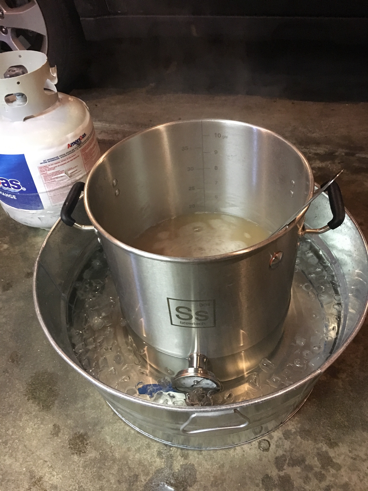

## Increasing my Chill
### How I sped up my wort chilling to save time and water

The initial setup I purchased included a really nice temperature controlled conical fermenter which 
has its own ability to crash wort to pitch temp with just some ice and a cooler. 

<figure class="post-image">
	
</figure>

This was great for my initial batches as its easy to connect to with the pumps and it a fairly straight forward set it and forget it solution but at nearly $800 a pop I really can't justify buying more of them to facilitate more that one brew at at time. As a workaround I quickly moved towards using PET plastic Fermonster fermenters that I thankfully can place in our crawl space that maintains a perfect ambient 68 degrees which is perfect for most of my ale recipes. This expansion however did require some process rethinking as I didn't initially have a way to traditionally cool wort outside of the SSBrewtech system.

<figure class="post-image">
	
</figure>

Initially I tried some fairly rudimentary methods to take advantage of winter temperatures including placing my kettle after the boil in an ice bath or even out in a snow bank in the yard if it was the winter months but coming into the more warm spring and summer months I wanted a better way to chill wort with less manual labor and risk of exposure to undesirable oxygen or bacteria. 

<figure class="post-image">
	
</figure>

<figure class="post-image">
	
</figure>

So with a bit of planning and some more equipment purchases I devised a multi stage chilling system to cool wort quicker. I started by just purchasing a traditional 25 ft immersion chiller with tap water at about 58 degress but I found I still was using far more water than I'd like and it took well over 30 minutes to get 5 gallons down to 68 degrees. Sadly after I started working on this project I learned one of my local homebrewing shops Brewmented was going out of business and would be liquidating their inventory. This sad news did however yield an opportunity to purchase a new smaller plate chiller at a heavily discounted price. Given I'm a software guy by day I decided to write up a schematic and design a system using both chillers a pump, some ball valves and a thrumometer to slow down the flow of wort through the system as to increase the contact with the cold water and to allow for recirculating through the kettle until its cool enough to transfer to a fermentor for pitching.

<figure class="post-image">
	
</figure>

<figure class="post-image">
	
</figure>

<figure class="post-image">
	
</figure>

After some adjustments and fine tuning I now have been able to crash wort down to pitch temp in roughly 10 - 15 minutes and I easily retain several gallons of warm water to use for immediate cleaning at the end of brew day. 
I also built a new brew stand and mounted the plate chiller to help with things not flopping around while the system is running, had I not done that I would suggest mounting it to a dedicated cooler.

Hope these ideas are helpful and I look forward to sharing more details of my equipment soon including a write up on how I built and designed my new brew stand. 

