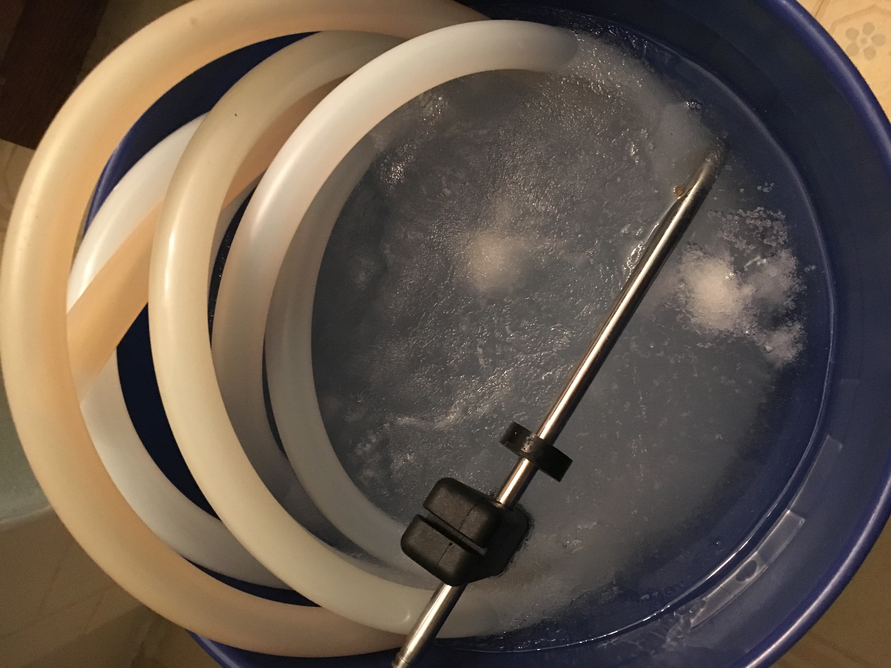

## My first dumper 
### A story of learning how not to brew a beer

So after my first initial batch I bought some wire racks from home depot and more formally set up my equipment as a gravity system. I also purchased a small anvil pump to help with moving liquid up the gravity system and struck out to do another brew but with a friend or two this time to help.

A friend and far more experienced homebrewer recommended that after the confusion and mixed results in my first 
batch I simplify my recipe design and do a SMaSH ale so I can focus on process and lower the number of variables.
So following this advice I decided to use Golden Promise for the malt and Galaxy for the hops.

The brew day from the get go was a bit off and I still was struggling with basic processes and how to dial in the nuances of my new system. Temperature was the first indicator that things weren't on track.
Given the insulation built into my mashtun there is a fairly significant temperature offset that I have to account for.
This was a cold day so my grain was cold and the mashtun was sitting at about 30 degrees. When I fired up the kettle to get my strike water ready based on the recipe I should have anticipated the cold but I didn't. 

The result was a mash in temp far lower than needed to get proper sugar conversion. 
My more experienced homebrewer friend tried to help right the ship by suggesting heating up some of the sparge water to a higher temp to try and raise the mash temp. This kind of worked but still resulted in a low yield. Plus I didn't have much water left to sparge and try to glean any extra sugars.

The hop schedule and the boil went better than the mash but I already had a lingering concern that this was not going to be a great beer. I finished up the brew day and transferred everything over to the fermenter and pitched my yeast. 
Now to add even more interesting events to this brew I also needed to travel for the holidays while this beer was fermenting. I was immediately concerned so I contacted my more experienced friend about what I should do if I wasn't home to keg the beer after fermentation and he assured me it wouldn't be an issue to leave it on the yeast a bit longe r than scheduled and that he wouldn't even run the temperature controller while we were away. Thankfully I didn't follow his advice on not controlling the temp as a massive cold front came through while we were out of town and froze several items in the garage and certainly could have damaged my fermentor.

<figure class="post-image">
	
</figure>

Despite the mess of unthawing frozen sanitizer, the beer in the fermenter survived largely unscathed.
I went ahead and transferred it over to a clean keg and started the process of force carbonating it.
I went ahead and took a gravity reading and the numbers weren't too far off so I began to have some hope this beer could make it after all. This hope quickly dissipated after I tasted it. Maybe it was just the recipe but I didn't like it. The flavor was too bitter and lacked any real substance. I think these ingredient would be great with a bit more balance but as a SMaSH it wasn't very exciting. 

To add insult to injury somehow during the racking I managed to healthily oxidize the beer so over the next week when I pulled samples to see if it had carbonated I was greeted with an awful color and a sinking feeling that this was going to be a dumper. 

<figure class="post-image">
	
</figure>

In the end the oxidation didn't too drastically impact the flavor like I read about when research what was happening but I still didn't like the flavor so I went ahead and dumped it as I wouldn't want to serve this to anyone.
Things I've learned since then are don't simplify your recipe design too much or you lose the flavors you enjoy in a good beer and slowing down during the process will help you make less mistakes. Thankfully I live in Colorado and good beer is always close by so despite mine not working out I wasn't too thirsty.

