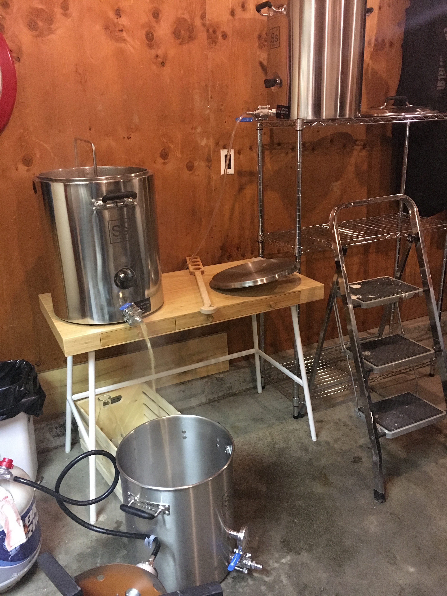

## Shady Malle

<!-- <dl>  
  <dt>Style</dt>
  <dd>Belgian Tripel, Trapist Ale</dd>
  
  <dt>OG</dt>
  <dd>1.010</dd>
  
  <dt>FG</dt>
  <dd>1.008</dd>
  
  <dt>ABV</dt>
  <dd>8.5%</dd>
</dl> -->

This was the inaugural brew on the new 5 gallon all grain system. 

Recipe and post coming soon.

