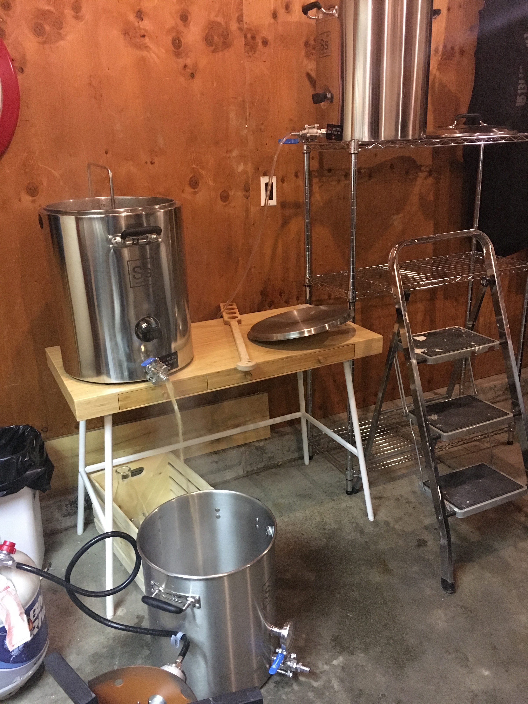
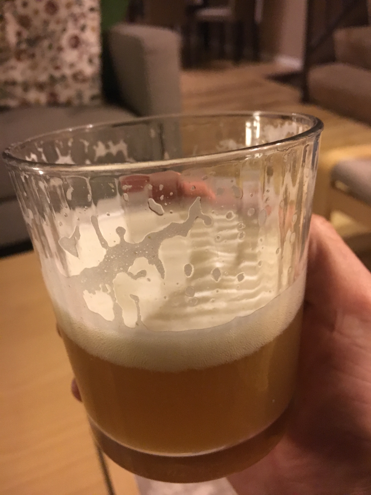

## The inaugural voyage

So I had bought the 5 gallon system, had gone to boulder fermentation supply and bumbled through finding a recipe and ingredients with the help of a shop regular and now it was time to embark on my first solo brew day.

<figure class="post-image">
  
</figure>

I picked up a wire rack from Lowes and snagged an Ikea desk that wasn't being used and tried to set up a basic gravity system. I unpacked, assembled and cleaned all my equipment with the PBW I had also purchased after visiting the homebrew shop and tried to plan a path into the unknown on a new system with only the internet and memories of what I had seen other brewers do in the past as an observer / assistant. My first recipe was photos on my phone of a West Malle recipe from a magazine I was referred to at the shop and my process was me taking a shot at following the getting started guide from the 5 gallon SsBrewtech kit which outlined some basics. I was so excited to finally brew so I dived in ready or not. 

It was stressful...

I struggled to handle temperature drops when transferring to my mashtun and my hlt.
I boiled off way more volume than planned.
During fermentation I couldn't get the trub to dump from my new conical due to poor process in the boil.
Kegging was messy to say the least and learning to force carb was wasteful.

In the end I barely managed to produce 3 and a half gallons of beer which I did keg and serve to my family when I hosted Thanksgiving. I also brought a growler to some friends to sample, everyone enjoyed it and had good things to say about the flavor and authenticity of the style. Free beer always gets good compliments but as a Belgian ale fan I was encouraged by the feedback and impressed enough with my own product to keep going and dive deeper. 

<figure class="post-image">
  
</figure>

I'm looking forward to brewing this again to see how the process improves and if I can increase efficiency. 

