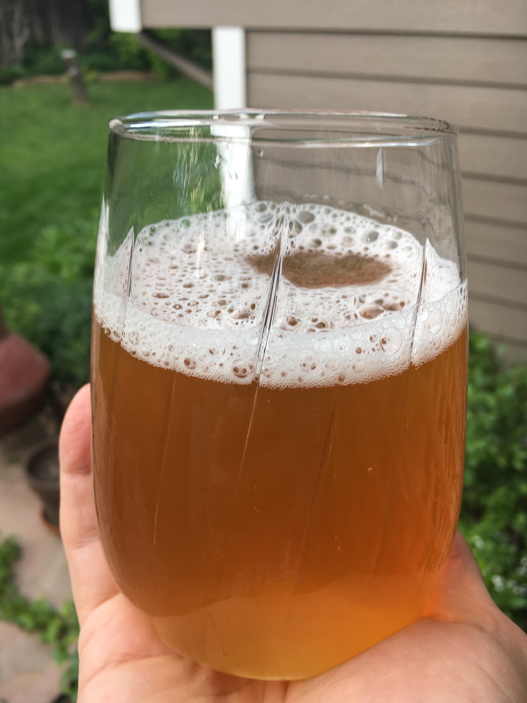

## High on a Mountain 
A dry, earthy medium bodied, Saison. 
My goal here was to create a recipe that loosely resembled a blueberry muffin.
Fresh muddled blueberries and Australian hops added a nice earthy and floral contrast to the 
slightly sweet and spicy rye. 

<section class='recipe'>

**Batch Size:** 5 gallon

**OG:** 1.047

**FG:** 1.002

**ABV:** 5.9%

### Fermentables
- 8 lbs - Pilsner 2 row malt 2 srm
- 2 lbs - Flaked Rye 4.6 srm
	
### Boil
- 1 oz - Wakatu (Hallertau Aroma) 8.4% AA - 60 minute 
- 1 oz - Motueka 7% AA - 0 minute steep for 15 minutes

### Yeast
- 1 packet of Imperial Napoleon (#B64)

### Dry Hop
- 1 oz - Motueka 7% - 10 days
- 1 oz - Nelson Sauvin 11.6% AA - 10 days
- 2.5 oz - Muddled fresh blueberries - 10 days

---
### Brew Steps

Standard 60 minute mash at 152, fly sparge at 168
and boil for 60 minutes. 

Cold condition for at least 2 weeks to get as much clarity as possible. 

<figure class="post-image">
	
</figure>

</section>

### Recommended Listening:

<iframe width="560" height="315" src="https://www.youtube.com/embed/X5rL-OHtg90" frameborder="0" allow="accelerometer; autoplay; encrypted-media; gyroscope; picture-in-picture" allowfullscreen></iframe>