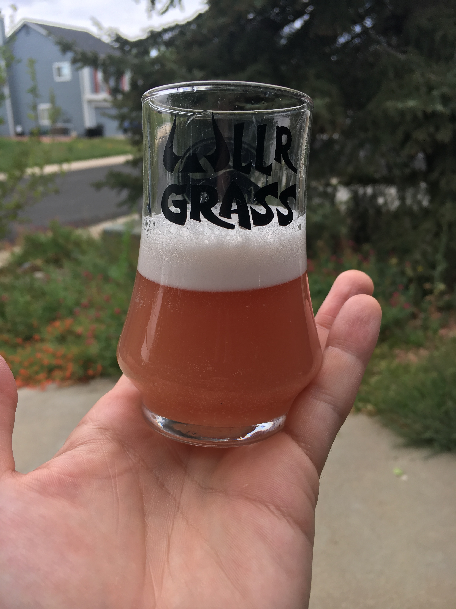

## Tennessee Stud 
A dry, medium bodied, aromatic Rosé Brüt IPA. 
I've experimented with more traditional versions of this style a bit and this my current preference on brewing a fun experimental version.

<section class='recipe'>

**Batch Size:** 5 gallon

**OG:** 1.055

**FG:** 1.009

**ABV:** 6%

### Fermentables
- 7 lbs - Pilsen 2 row malt 1.2 srm
- 4 lbs - Flaked Wheat
	
### Boil
- 1 oz - El Dorado 15.10% AA - 15 minute 
- 1 oz - Galaxy 16.10% AA - 5 minute
- 1 - Whirlfloc Tablet - 15 minute

### Yeast
- 1 packet of Imperial House (#A01)

### Dry Hop
- 1 oz - El Dorado 15.10% AA - 10 days
- 1 oz - Hallertau Blanc 8.5% AA - 10 days
- 1 oz - Nelson Sauvin 10.6% AA - 10 days
- 0.2 oz - Amylase Enzyme - 10 days
- 2 oz - Dried Hibiscus - 2 days

---
### Brew Steps

Standard 60 minute mash at 152, fly sparge at 168
and boil for 60 minutes. 

Cold condition for at least 2 weeks to get as much clarity as possible. 

<figure class="post-image">
	
	<figcaption>I love the color after fermentation before cold conditioning clears things up.</figcaption>
</figure>

#### Serving / Conditioning
I've read and heard great things about Gelatin for this style but didn't have much luck personally so I typically just filter as part of my typical brewing process and let it cold condition for a bit longer with the goal of champagne like clarity then I then force carb and serve from a keg a bit higher at 20 PSI to get slightly more champagne like foam. 
	
</section>

### Recommended Listening:

<iframe width="560" height="315" src="https://www.youtube.com/embed/xsF2fBadHqg" frameborder="0" allow="accelerometer; autoplay; encrypted-media; gyroscope; picture-in-picture" allowfullscreen></iframe>