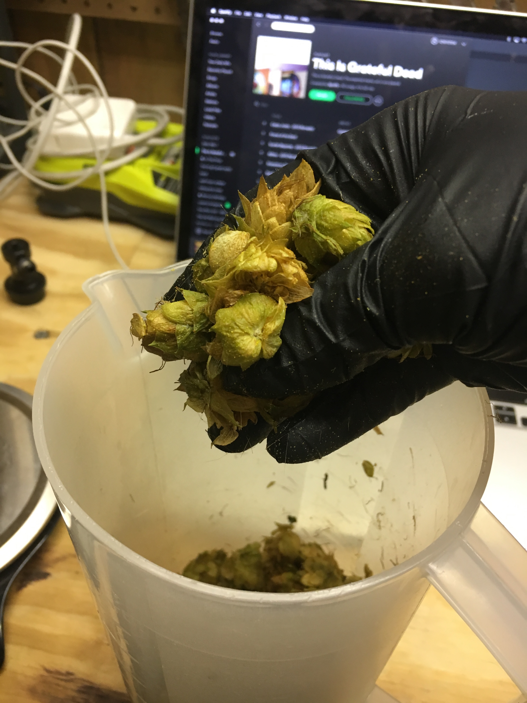
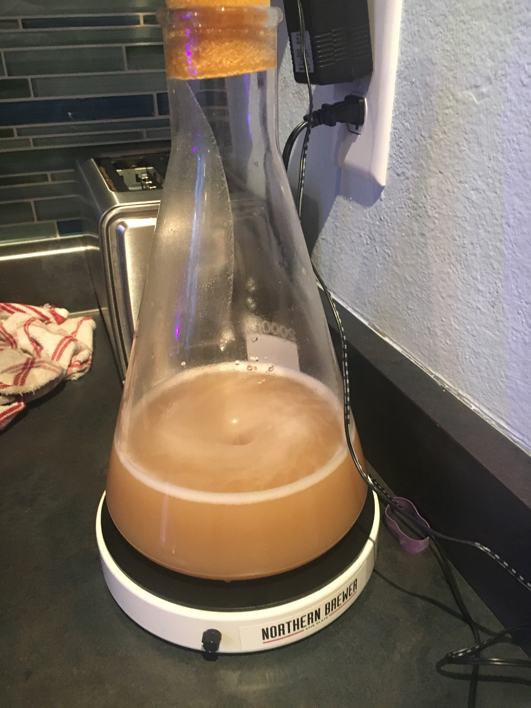

## Wild Horses
An experimental saison wet hopped with wild captured hops

A friend of a friend discovered a healthy crop of unidentified hops growing and harvested some for me to experiment with. She was able vacuum seal a few ounces so I built out a funky recipe with vic secret and a yeast I hadn't tried before to use them with and see what happens.

<section class='recipe'>

**Batch Size:** 5 gallon

**OG:** 1.045

**FG:** 1.004

**ABV:** 5.4%

### Fermentables
- 7 lbs - Pilsner malt 2 srm
- 2 lbs - Flaked Oats 2.4 srm
- 1 lbs - Carmel 20L 
- 1 lbs - Cara-pils 2 srm
	
### Boil
- 2 oz - Wild captured hops ? AA - 60 minute 
- 0.5 oz - Vic Secret 15.5% AA - 15 minute

### Yeast
- 2 packets of Bootleg Biology Mad Fermentationist Saison Blend

### Dry Hop
- 0.5 oz - Pearle 5.8% - 10 days
- 1 oz - Huell Melon 15.5% AA - 10 days
- 

---
### Brew Steps
I used a standard 60 minute single infusion mash at 152 then fly sparge at 168.

For hopping I hand ruptured the wet mystery hops then dumped them into the hop spider and actually used them for first wort hopping then followed my standard process through the boil for 60 minutes. 

<figure class="post-image">
	
</figure>

The original packet of this yeast that I picked up was pretty old so after slowly ramping the temp to 75 degrees over the first few days of primary without much activity I snagged a second packet and built a starter to pitch heading into secondary. 

<figure class="post-image">
	
</figure>

Following the spirit of experimentation with this beer I tried using oak chips for first time as well to get some tannins and a hopefully heightened crispness in hindsight I'd use oak in this setting for far fewer days as it got a bit too pronounced.

I cold conditioned for a full 4 weeks to help the oak mellow out and then carbed it a bit higher to try an heighten the percecption of bitterness. 

</section>

### Recommended Listening:

<iframe width="560" height="315" src="https://www.youtube.com/embed/sCpCmt0OXNc" frameborder="0" allow="accelerometer; autoplay; encrypted-media; gyroscope; picture-in-picture" allowfullscreen></iframe>